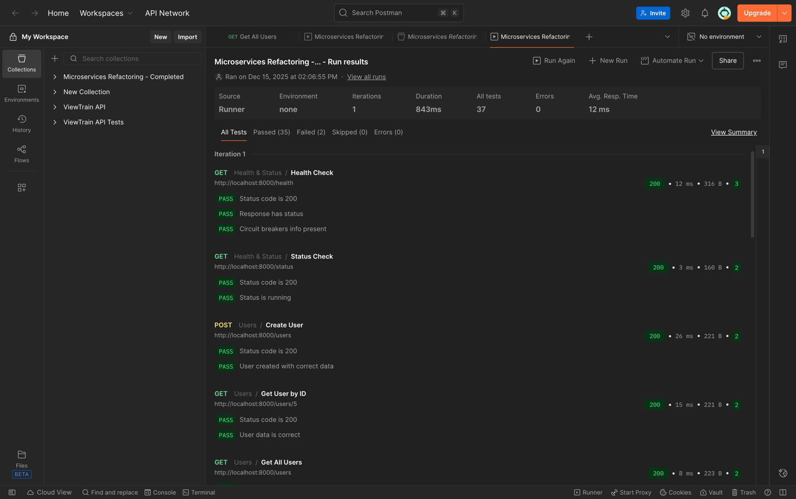
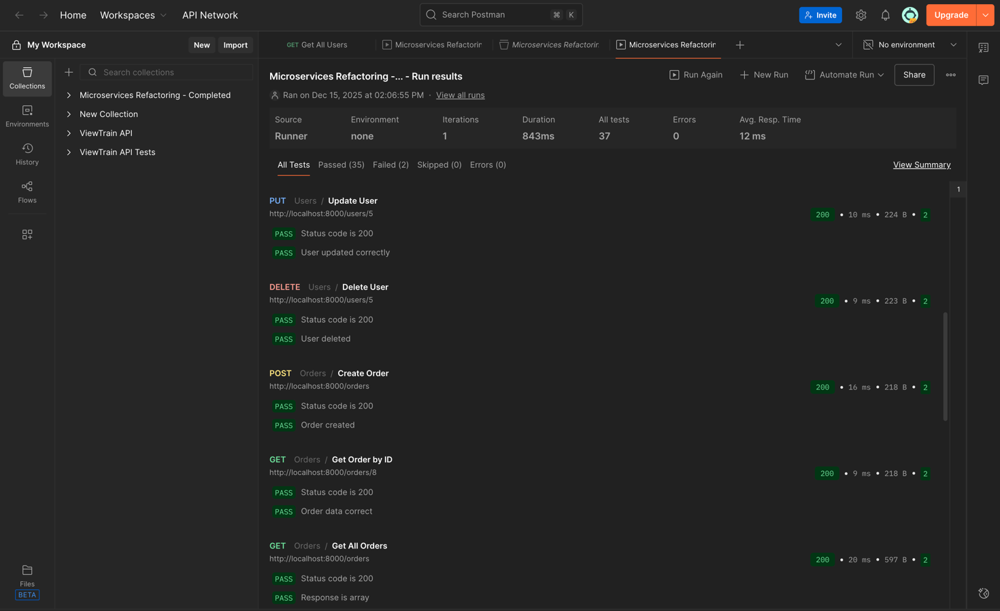
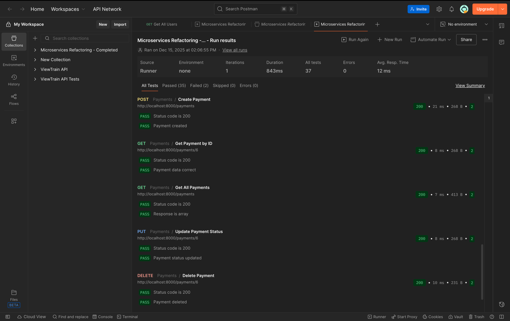

# Отчет о рефакторинге: разбиение монолита на микросервисы

## Отчет выполнил студент группы ЭФБО-06-22, Крояков Андрей

## ссылка на репозиторий проекта https://github.com/ScorpionAlfach/refactoring_3?tab=readme-ov-file

## Проблема

монолитное приложение где все сущности в одном файле, данные хранятся в памяти, при перезапуске всё теряется.

```python
from fastapi import FastAPI, HTTPException

app = FastAPI()

users_db = {}
orders_db = {}
payments_db = {}
user_counter = 0
order_counter = 0
payment_counter = 0


@app.post("/users")
def create_user(email: str, name: str):
    global user_counter
    user_counter += 1
    users_db[user_counter] = {"id": user_counter, "email": email, "name": name}
    return users_db[user_counter]


@app.get("/users/{user_id}")
def get_user(user_id: int):
    if user_id not in users_db:
        raise HTTPException(status_code=404, detail="User not found")
    return users_db[user_id]


@app.post("/orders")
def create_order(user_id: int, product: str, quantity: int):
    global order_counter
    if user_id not in users_db:
        raise HTTPException(status_code=404, detail="User not found")
    order_counter += 1
    orders_db[order_counter] = {
        "id": order_counter,
        "userId": user_id,
        "product": product,
        "quantity": quantity
    }
    return orders_db[order_counter]


@app.get("/orders/{order_id}")
def get_order(order_id: int):
    if order_id not in orders_db:
        raise HTTPException(status_code=404, detail="Order not found")
    return orders_db[order_id]


@app.post("/payments")
def create_payment(order_id: int, amount: float):
    global payment_counter
    if order_id not in orders_db:
        raise HTTPException(status_code=404, detail="Order not found")
    payment_counter += 1
    payments_db[payment_counter] = {
        "id": payment_counter,
        "order_id": order_id,
        "amount": amount,
        "status": "pending"
    }
    return payments_db[payment_counter]


@app.get("/users/{user_id}/details")
def get_user_details(user_id: int):
    if user_id not in users_db:
        raise HTTPException(status_code=404, detail="User not found")
    user = users_db[user_id]
    user_orders = [o for o in orders_db.values() if o["userId"] == user_id]
    return {"user": user, "orders": user_orders}
```

---

## Решение

разбить на отдельные микросервисы (users, orders, payments) с собственными базами postgresql, добавить api gateway для маршрутизации, redis для кэширования, circuit breaker для отказоустойчивости

---

## Код после рефакторинга

### структура проекта

```
api_gateway/
    main.py
service_users/
    app/
        main.py
        models.py
        schemas.py
        database.py
        redis_client.py
        routes/users.py
        services/user_service.py
service_orders/
    app/
        ...аналогичная структура
service_payments/
    app/
        ...аналогичная структура
docker-compose.yml
```

### api gateway с circuit breaker

```python
from fastapi import FastAPI, HTTPException, Request
import httpx
import asyncio
from datetime import datetime, timedelta
from typing import Optional

app = FastAPI(title="API Gateway")

USERS_SERVICE_URL = "http://service_users:8000"
ORDERS_SERVICE_URL = "http://service_orders:8000"
PAYMENTS_SERVICE_URL = "http://service_payments:8000"


class CircuitBreaker:
    def __init__(self, name: str):
        self.name = name
        self.failure_count = 0
        self.failure_threshold = 5
        self.timeout_duration = 30
        self.last_failure_time: Optional[datetime] = None
        self.state = "CLOSED"

    def is_open(self) -> bool:
        if self.state == "OPEN":
            if self.last_failure_time and \
               datetime.now() - self.last_failure_time > timedelta(seconds=self.timeout_duration):
                self.state = "HALF_OPEN"
                return False
            return True
        return False

    def record_success(self):
        self.failure_count = 0
        if self.state == "HALF_OPEN":
            self.state = "CLOSED"

    def record_failure(self):
        self.failure_count += 1
        self.last_failure_time = datetime.now()
        if self.failure_count >= self.failure_threshold:
            self.state = "OPEN"

    async def call(self, func, *args, **kwargs):
        if self.is_open():
            raise HTTPException(status_code=503, detail=f"{self.name} service unavailable")
        try:
            result = await func(*args, **kwargs)
            self.record_success()
            return result
        except Exception as e:
            self.record_failure()
            raise e


users_circuit = CircuitBreaker("Users")
orders_circuit = CircuitBreaker("Orders")
payments_circuit = CircuitBreaker("Payments")


async def make_request(url: str, method: str = "GET", data: dict = None):
    async with httpx.AsyncClient(timeout=3.0) as client:
        if method == "GET":
            response = await client.get(url)
        elif method == "POST":
            response = await client.post(url, json=data)
        elif method == "PUT":
            response = await client.put(url, json=data)
        elif method == "DELETE":
            response = await client.delete(url)
        response.raise_for_status()
        return response.json()


@app.get("/users/{user_id}")
async def get_user(user_id: int):
    return await users_circuit.call(make_request, f"{USERS_SERVICE_URL}/users/{user_id}")


@app.get("/users/{user_id}/details")
async def get_user_details(user_id: int):
    user_task = users_circuit.call(make_request, f"{USERS_SERVICE_URL}/users/{user_id}")
    orders_task = orders_circuit.call(make_request, f"{ORDERS_SERVICE_URL}/orders")
    user, all_orders = await asyncio.gather(user_task, orders_task)
    user_orders = [o for o in all_orders if o.get("userId") == user_id]
    return {"user": user, "orders": user_orders}
```

---

### микросервис users

**models.py**

```python
from sqlalchemy import Column, Integer, String, DateTime
from datetime import datetime
from .database import Base


class User(Base):
    __tablename__ = "users"

    id = Column(Integer, primary_key=True, index=True)
    email = Column(String, unique=True, index=True, nullable=False)
    name = Column(String, nullable=False)
    created_at = Column(DateTime, default=datetime.utcnow)
```

**user_service.py с кэшированием**

```python
from sqlalchemy.orm import Session
from typing import Optional, List
from ..models import User
from ..schemas import UserCreate, UserUpdate
from ..redis_client import redis_client


class UserService:

    @staticmethod
    def get_user_by_id(db: Session, user_id: int) -> Optional[dict]:
        cache_key = f"user:{user_id}"

        cached_user = redis_client.get(cache_key)
        if cached_user:
            return cached_user

        user = db.query(User).filter(User.id == user_id).first()
        if not user:
            return None

        user_dict = {
            "id": user.id,
            "email": user.email,
            "name": user.name,
            "created_at": user.created_at.isoformat()
        }

        redis_client.set(cache_key, user_dict, expire=300)
        return user_dict

    @staticmethod
    def update_user(db: Session, user_id: int, user_data: UserUpdate) -> Optional[User]:
        user = db.query(User).filter(User.id == user_id).first()
        if not user:
            return None

        update_data = user_data.model_dump(exclude_unset=True)
        for key, value in update_data.items():
            setattr(user, key, value)

        db.commit()
        db.refresh(user)
        redis_client.delete(f"user:{user_id}")
        return user

    @staticmethod
    def delete_user(db: Session, user_id: int) -> Optional[User]:
        user = db.query(User).filter(User.id == user_id).first()
        if not user:
            return None

        db.delete(user)
        db.commit()
        redis_client.delete(f"user:{user_id}")
        return user
```

---

### docker-compose.yml

```yaml
version: '3.8'

services:
  api_gateway:
    build: ./api_gateway
    ports:
      - "8000:8000"
    depends_on:
      - service_users
      - service_orders
      - service_payments

  service_users:
    build: ./service_users
    depends_on:
      - db_users
      - cache

  service_orders:
    build: ./service_orders
    depends_on:
      - db_orders
      - cache

  service_payments:
    build: ./service_payments
    depends_on:
      - db_payments
      - cache

  db_users:
    image: postgres:15
    environment:
      POSTGRES_USER: user
      POSTGRES_PASSWORD: password
      POSTGRES_DB: users_db

  db_orders:
    image: postgres:15
    environment:
      POSTGRES_USER: user
      POSTGRES_PASSWORD: password
      POSTGRES_DB: orders_db

  db_payments:
    image: postgres:15
    environment:
      POSTGRES_USER: user
      POSTGRES_PASSWORD: password
      POSTGRES_DB: payments_db

  cache:
    image: redis:7
```

---

## Итог

монолит разбит на три независимых микросервиса, каждый со своей бд, добавлено кэширование через redis с инвалидацией при изменениях, circuit breaker защищает от каскадных отказов, api aggregation позволяет получать связанные данные одним запросом.



